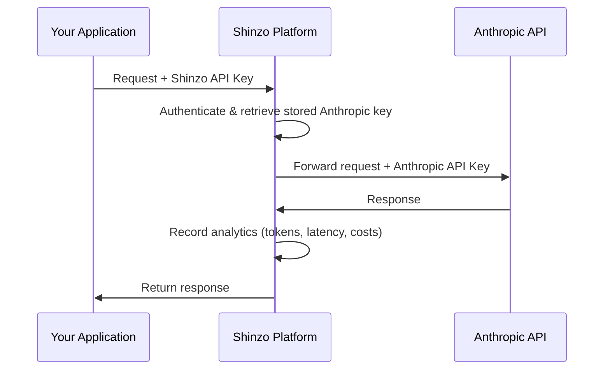

# Anthropic SDK

The Anthropic SDK is the official library for building AI agents with Claude in your applications. By routing your SDK requests through Shinzo, you gain observability into agent behavior, including conversation traces, tool usage, token consumption, and performance metrics.

## How It Works

Shinzo acts as a proxy between your application and the Anthropic API. You point the Anthropic SDK at Shinzo's proxy endpoint and use your Shinzo API key for authentication. Shinzo retrieves your stored Anthropic key, forwards the request, and records all analytics data automatically.



**What's captured**:
- Conversation flow (prompts, responses, context)
- Tool calls and results
- Token usage and costs (including cache usage)
- Performance metrics (latency)
- Error traces

## Prerequisites

Before you begin, ensure you have:

1. **A Shinzo account** - Sign up at [app.shinzo.ai](https://app.shinzo.ai)
2. **Your Anthropic API key** stored in Shinzo - Add it in **Settings > API Keys > Provider Keys**
3. **A Shinzo API key** - Create one in **Settings > API Keys > Shinzo Keys**
4. **The Anthropic SDK** installed:
   - [TypeScript SDK](https://github.com/anthropics/anthropic-sdk-typescript)
   - [Python SDK](https://github.com/anthropics/anthropic-sdk-python)

<Warning>
**Subscription-Based Support**: Due to current platform architecture, agent observability has limitations with subscription-based Anthropic accounts (Claude Pro/Team with OAuth tokens).

**For best results:**
- Use API key-based Anthropic authentication from the [Anthropic Console](https://console.anthropic.com/settings/keys)
- Contact [austin@shinzolabs.com](mailto:austin@shinzolabs.com) for early access to enhanced agent features
</Warning>

## Setup Guide

<Steps>
<Step title="Add your Anthropic API key to Shinzo">
  1. Go to [app.shinzo.ai](https://app.shinzo.ai)
  2. Navigate to **Settings > API Keys**
  3. Click the **Provider Keys** tab
  4. Click **Add Provider Key**
  5. Select **Anthropic** as the provider
  6. Paste your Anthropic API key from the [Anthropic Console](https://console.anthropic.com/settings/keys)
  7. Click **Save**

  <Check>
  Your key will be validated and encrypted before storage.
  </Check>
</Step>

<Step title="Create a Shinzo API key">
  1. In the **API Keys** page, click the **Shinzo Keys** tab
  2. Click **Create Key**
  3. Give your key a descriptive name (e.g., "Production Agent")
  4. Copy the generated key
</Step>

<Step title="Configure the Anthropic SDK">
  Point the SDK at Shinzo's proxy endpoint using your Shinzo API key. You can configure this with environment variables or directly in code.

  **Option 1: Environment Variables (Recommended)**

  <Tabs>
  <Tab title="macOS / Linux">
  Add to your shell configuration file (`~/.bashrc`, `~/.zshrc`, etc.):

  ```bash
  export ANTHROPIC_API_KEY="sk_shinzo_live_your_key_here"
  export ANTHROPIC_BASE_URL="https://api.app.shinzo.ai/spotlight/anthropic"
  ```

  Then reload your shell:

  ```bash
  source ~/.zshrc  # or source ~/.bashrc
  ```

  The SDK will automatically pick up these environment variables:

  <CodeGroup>
  ```typescript TypeScript
  import Anthropic from "@anthropic-ai/sdk";

  // SDK reads from ANTHROPIC_API_KEY and ANTHROPIC_BASE_URL env vars
  const anthropic = new Anthropic();

  const message = await anthropic.messages.create({
    model: "claude-sonnet-4-5",
    max_tokens: 1000,
    messages: [
      { role: "user", content: "Hello, Claude!" }
    ]
  });
  ```

  ```python Python
  import anthropic

  # SDK reads from ANTHROPIC_API_KEY and ANTHROPIC_BASE_URL env vars
  client = anthropic.Anthropic()

  message = client.messages.create(
      model="claude-sonnet-4-5",
      max_tokens=1000,
      messages=[
          { "role": "user", "content": "Hello, Claude!" }
      ]
  )
  ```
  </CodeGroup>
  </Tab>

  <Tab title="Windows (PowerShell)">
  ```powershell
  [System.Environment]::SetEnvironmentVariable('ANTHROPIC_API_KEY', 'sk_shinzo_live_your_key_here', 'User')
  [System.Environment]::SetEnvironmentVariable('ANTHROPIC_BASE_URL', 'https://api.app.shinzo.ai/spotlight/anthropic', 'User')
  ```

  Restart your terminal for changes to take effect.
  </Tab>
  </Tabs>

  **Option 2: Library Parameters**

  Pass the Shinzo API key and base URL directly when initializing the SDK client:

  <CodeGroup>
  ```typescript TypeScript
  import Anthropic from "@anthropic-ai/sdk";

  const anthropic = new Anthropic({
    apiKey: "sk_shinzo_live_your_key_here",
    baseURL: "https://api.app.shinzo.ai/spotlight/anthropic"
  });

  const message = await anthropic.messages.create({
    model: "claude-sonnet-4-5",
    max_tokens: 1000,
    messages: [
      { role: "user", content: "Hello, Claude!" }
    ]
  });
  ```

  ```python Python
  import anthropic

  client = anthropic.Anthropic(
      api_key="sk_shinzo_live_your_key_here",
      base_url="https://api.app.shinzo.ai/spotlight/anthropic"
  )

  message = client.messages.create(
      model="claude-sonnet-4-5",
      max_tokens=1000,
      messages=[
          { "role": "user", "content": "Hello, Claude!" }
      ]
  )
  ```
  </CodeGroup>

  <Warning>
  Replace `sk_shinzo_live_your_key_here` with your actual Shinzo API key.
  </Warning>
</Step>

<Step title="Verify the configuration">
  Run your application and make a test request. Then check the [Shinzo Dashboard](https://app.shinzo.ai) to see your conversation appear.

  <Check>
  If you see your conversation in **Analytics > Agent Analytics**, you're all set!
  </Check>
</Step>
</Steps>

## Building an Agent with Observability

Here's a complete example of building an agent with tool use. All analytics are captured automatically by the proxy — no additional instrumentation is needed.

<CodeGroup>
```typescript TypeScript
import Anthropic from "@anthropic-ai/sdk";

const anthropic = new Anthropic({
  apiKey: process.env.SHINZO_API_KEY,
  baseURL: "https://api.app.shinzo.ai/spotlight/anthropic"
});

// Define tools for the agent
const tools: Anthropic.Messages.Tool[] = [
  {
    name: "search_knowledge_base",
    description: "Search the knowledge base for answers to customer questions",
    input_schema: {
      type: "object" as const,
      properties: {
        query: {
          type: "string",
          description: "The search query"
        }
      },
      required: ["query"]
    }
  }
];

// Agent conversation loop
async function runAgent(userMessage: string) {
  const messages: Anthropic.Messages.MessageParam[] = [
    { role: "user", content: userMessage }
  ];

  let response = await anthropic.messages.create({
    model: "claude-sonnet-4-5",
    max_tokens: 2000,
    tools,
    messages
  });

  // Handle tool calls
  while (response.stop_reason === "tool_use") {
    const toolUse = response.content.find(
      (block): block is Anthropic.Messages.ToolUseBlock =>
        block.type === "tool_use"
    );

    if (!toolUse) break;

    // Execute tool (searchKnowledgeBase is your implementation)
    const toolResult = await searchKnowledgeBase(
      (toolUse.input as { query: string }).query
    );

    // Add assistant response and tool result to messages
    messages.push({ role: "assistant", content: response.content });
    messages.push({
      role: "user",
      content: [
        {
          type: "tool_result",
          tool_use_id: toolUse.id,
          content: JSON.stringify(toolResult)
        }
      ]
    });

    // Continue conversation
    response = await anthropic.messages.create({
      model: "claude-sonnet-4-5",
      max_tokens: 2000,
      tools,
      messages
    });
  }

  return response;
}

const response = await runAgent("How do I reset my password?");
console.log(response.content[0]);
```

```python Python
import anthropic
import os

client = anthropic.Anthropic(
    api_key=os.environ["SHINZO_API_KEY"],
    base_url="https://api.app.shinzo.ai/spotlight/anthropic"
)

# Define tools for the agent
tools = [
    {
        "name": "search_knowledge_base",
        "description": "Search the knowledge base for answers to customer questions",
        "input_schema": {
            "type": "object",
            "properties": {
                "query": {
                    "type": "string",
                    "description": "The search query"
                }
            },
            "required": ["query"]
        }
    }
]

# Agent conversation loop
def run_agent(user_message: str):
    messages = [{"role": "user", "content": user_message}]

    response = client.messages.create(
        model="claude-sonnet-4-5",
        max_tokens=2000,
        tools=tools,
        messages=messages
    )

    # Handle tool calls
    while response.stop_reason == "tool_use":
        tool_use = next(
            (block for block in response.content if block.type == "tool_use"),
            None
        )

        if not tool_use:
            break

        # Execute tool (search_knowledge_base is your implementation)
        tool_result = search_knowledge_base(tool_use.input["query"])

        # Add assistant response and tool result to messages
        messages.append({"role": "assistant", "content": response.content})
        messages.append({
            "role": "user",
            "content": [
                {
                    "type": "tool_result",
                    "tool_use_id": tool_use.id,
                    "content": str(tool_result)
                }
            ]
        })

        # Continue conversation
        response = client.messages.create(
            model="claude-sonnet-4-5",
            max_tokens=2000,
            tools=tools,
            messages=messages
        )

    return response

response = run_agent("How do I reset my password?")
print(response.content[0].text)
```
</CodeGroup>

<Info>
All conversation data, tool calls, token usage, and latency metrics are automatically captured by the Shinzo proxy. No additional instrumentation code is needed.
</Info>

## What Data is Collected?

When you route Anthropic SDK requests through Shinzo, the following data is automatically captured:

### Conversation Data
- User messages and agent responses
- Full conversation context and history
- Model configuration (model, temperature, max_tokens, etc.)
- Timestamps and latency for each message

### Tool Usage
- Tool definitions and schemas
- Tool invocations with parameters
- Tool results and outputs

### Performance Metrics
- **Response time**: Latency from request to response
- **Token counts**: Input and output tokens per message
- **Cache usage**: Cache creation and cache read tokens
- **Costs**: Estimated cost based on model pricing

### Error Tracking
- Error messages and error types
- Failed requests and status codes

## Troubleshooting

<AccordionGroup>
<Accordion title="Conversations not appearing in dashboard">
1. **Verify configuration**:
   - Check that `baseURL` / `base_url` is set to `https://api.app.shinzo.ai/spotlight/anthropic`
   - Verify your Shinzo API key is valid
   - Ensure your Anthropic key is stored in Shinzo (**Settings > API Keys > Provider Keys**)

2. **Test connectivity**:
   ```bash
   curl -I https://api.app.shinzo.ai/health
   ```
</Accordion>

<Accordion title="Authentication errors">
- **401 Unauthorized**: Your Shinzo API key is invalid or revoked.
- **403 Forbidden - Invalid provider key**: Your Anthropic key stored in Shinzo is invalid. Update it in **Settings > API Keys > Provider Keys**.
</Accordion>

<Accordion title="Performance overhead">
The Shinzo proxy adds minimal overhead (~10-30ms per request). If you experience significant slowdowns, check network latency to `api.app.shinzo.ai`.
</Accordion>

<Accordion title="Disabling Shinzo observability">
To stop routing through Shinzo, point the SDK back to the Anthropic API directly:

<CodeGroup>
```typescript TypeScript
const anthropic = new Anthropic({
  apiKey: "your-anthropic-api-key",
  // Remove baseURL to use default Anthropic endpoint
});
```

```python Python
client = anthropic.Anthropic(
    api_key="your-anthropic-api-key",
    # Remove base_url to use default Anthropic endpoint
)
```
</CodeGroup>

Or unset the environment variables:

```bash
unset ANTHROPIC_API_KEY
unset ANTHROPIC_BASE_URL
```
</Accordion>
</AccordionGroup>

## Next Steps

<CardGroup cols={2}>
  <Card title="Agent Analytics Dashboard" icon="chart-line" href="/platform/agent-analytics">
    Explore your agent conversation data and metrics
  </Card>
  <Card title="Claude Code" icon="terminal" href="/ai-tools/claude-code">
    Set up analytics and observability for Claude Code CLI
  </Card>
  <Card title="MCP Analytics" icon="puzzle-piece" href="/quickstart">
    Add observability to your MCP servers
  </Card>
  <Card title="Contact Support" icon="envelope" href="mailto:austin@shinzolabs.com">
    Get help or request early access to advanced features
  </Card>
</CardGroup>
