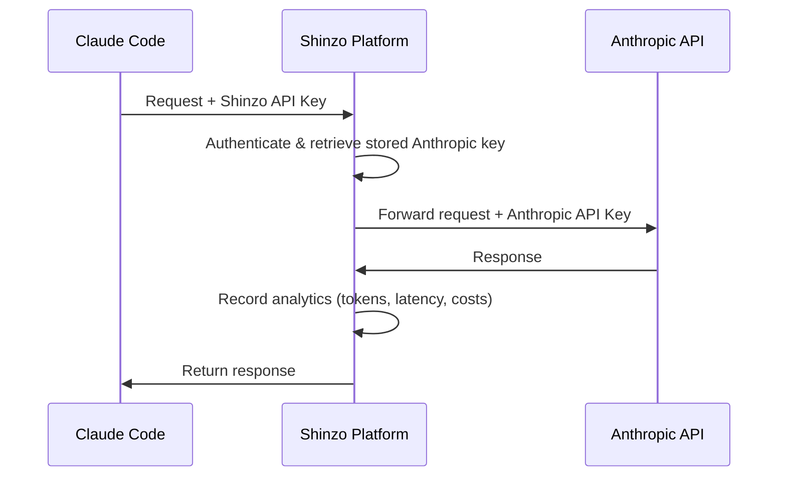

# Claude Code

Claude Code is Anthropic's official CLI tool for interacting with Claude directly from your terminal. By routing Claude Code through Shinzo, you gain comprehensive visibility into your AI usage patterns, token consumption, response times, costs, and full conversation traces with tool usage.

## How It Works

Shinzo acts as a proxy between Claude Code and the Anthropic API. All requests are forwarded through Shinzo, which records analytics data before passing the request to Anthropic with your stored provider key.



**What's captured**:
- Conversation flow (prompts, responses, context)
- Tool calls and results
- Token usage and costs (including cache usage)
- Performance metrics (latency)
- Error traces

## Prerequisites

Before you begin, ensure you have:

1. **A Shinzo account** - Sign up at [app.shinzo.ai](https://app.shinzo.ai)
2. **Claude Code installed** - Get it from [GitHub](https://github.com/anthropics/claude-code)
3. **Your Anthropic API key** stored in Shinzo - Add it in **Settings > API Keys > Provider Keys**
4. **A Shinzo API key** - Create one in **Settings > API Keys > Shinzo Keys**

<Warning>
**Subscription-Based Support**: Due to current platform architecture, Claude Code observability has limitations with subscription-based Anthropic accounts (Claude Pro/Team with OAuth tokens).

**For best results:**
- Use API key-based Anthropic authentication from the [Anthropic Console](https://console.anthropic.com/settings/keys)
- Contact [austin@shinzolabs.com](mailto:austin@shinzolabs.com) for early access to enhanced agent features
</Warning>

## Setup Guide

Follow these steps to configure Claude Code with Shinzo:

<Steps>
<Step title="Add your Anthropic API key to Shinzo">
  1. Go to [app.shinzo.ai](https://app.shinzo.ai)
  2. Navigate to **Settings > API Keys**
  3. Click the **Provider Keys** tab
  4. Click **Add Provider Key**
  5. Select **Anthropic** as the provider
  6. Paste your Anthropic API key from the [Anthropic Console](https://console.anthropic.com/settings/keys)
  7. Add a descriptive label (e.g., "Claude Code Production")
  8. Click **Save**

  <Check>
  Your key will be validated and encrypted before storage.
  </Check>
</Step>

<Step title="Create a Shinzo API key">
  1. In the **API Keys** page, click the **Shinzo Keys** tab
  2. Click **Create Key**
  3. Give your key a descriptive name (e.g., "Claude Code Desktop")
  4. Copy the generated key (you won't see it again)

  <Warning>
  Store this key securely - you'll need it in the next step.
  </Warning>
</Step>

<Step title="Configure Claude Code environment variables">
  Set the following environment variables to route Claude Code through Shinzo:

  <Tabs>
  <Tab title="macOS / Linux">
  Add to your shell configuration file (`~/.bashrc`, `~/.zshrc`, etc.):

  ```bash
  export ANTHROPIC_BASE_URL="https://api.app.shinzo.ai/spotlight/anthropic"
  export ANTHROPIC_CUSTOM_HEADERS="x-shinzo-api-key: sk_shinzo_live_your_key_here"
  ```

  Then reload your shell:

  ```bash
  source ~/.zshrc  # or source ~/.bashrc
  ```
  </Tab>

  <Tab title="Windows (PowerShell)">
  Run the following commands to set persistent environment variables:

  ```powershell
  [System.Environment]::SetEnvironmentVariable('ANTHROPIC_BASE_URL', 'https://api.app.shinzo.ai/spotlight/anthropic', 'User')
  [System.Environment]::SetEnvironmentVariable('ANTHROPIC_CUSTOM_HEADERS', 'x-shinzo-api-key: sk_shinzo_live_your_key_here', 'User')
  ```

  Restart your terminal for changes to take effect.
  </Tab>

  <Tab title="Windows (Command Prompt)">
  Run the following commands:

  ```cmd
  setx ANTHROPIC_BASE_URL "https://api.app.shinzo.ai/spotlight/anthropic"
  setx ANTHROPIC_CUSTOM_HEADERS "x-shinzo-api-key: sk_shinzo_live_your_key_here"
  ```

  Restart your terminal for changes to take effect.
  </Tab>
  </Tabs>

  <Warning>
  Replace `sk_shinzo_live_your_key_here` with your actual Shinzo API key from Step 2.
  </Warning>

  <Info>
  **Configuration Breakdown**:
  - `ANTHROPIC_BASE_URL`: Redirects Claude Code to Shinzo's Anthropic proxy endpoint
  - `ANTHROPIC_CUSTOM_HEADERS`: Passes your Shinzo API key for authentication
  </Info>
</Step>

<Step title="Verify the configuration">
  Test your configuration by running a simple Claude Code command:

  ```bash
  claude "What is the capital of France?"
  ```

  <Note>
  **First-time login flow:**

  When you first run Claude Code with Shinzo configured, you may see several login screens. Follow these steps:

  1. When prompted to choose a login method, select **"Anthropic Console account · API usage billing"** (not a subscription-based option)
  2. If you see "Detected a custom API key in your environment... Do you want to use this API key?", select **"No (Recommended)"**
  3. You may need to restart `claude` after completing login for Shinzo observability to take effect
  </Note>

  Then check the [Shinzo Dashboard](https://app.shinzo.ai) to see your conversation appear.

  <Check>
  If you see your conversation in the dashboard with full trace details, you're all set!
  </Check>
</Step>
</Steps>

## What Data is Collected?

When you use Claude Code through Shinzo, the following data is automatically captured by the proxy:

### Conversation Data
- **User prompts**: The questions or commands you send to Claude
- **Agent responses**: Claude's text responses
- **Conversation context**: Full conversation history and context
- **Model configuration**: Model version, temperature, max tokens, etc.
- **Timestamps**: When each message was sent and received

### Tool Usage
- **Tool calls**: Which tools Claude invokes (file operations, bash commands, etc.)
- **Tool parameters**: Arguments passed to each tool
- **Tool results**: Output returned from tool executions

### Performance Metrics
- **Response time**: Latency from request to response
- **Token counts**: Input and output tokens per message
- **Cache usage**: Cache creation and cache read tokens
- **Costs**: Estimated cost per conversation based on model pricing

<Info>
All data is sent securely over HTTPS and encrypted at rest in Shinzo's infrastructure.
</Info>

## Viewing Your Data

Once configured, you can view your Claude Code data in the Shinzo dashboard:

### Agent Analytics Dashboard

Navigate to **Analytics > Agent Analytics** in the Shinzo dashboard to see:

- **Conversation traces**: Full conversation flows with timing data
- **Tool usage patterns**: Which tools are used most frequently
- **Token consumption**: Token usage over time with cost breakdown
- **Performance trends**: Response times and throughput metrics

<Card title="Agent Analytics Dashboard" icon="chart-line" href="/platform/agent-analytics">
  Learn more about the agent analytics dashboard
</Card>

### Individual Conversation View

Click on any conversation to see:

- **Full conversation transcript**: All messages in the conversation
- **Token breakdown**: Detailed token usage per message including cache hits
- **Performance metrics**: Latency for each interaction

## Troubleshooting

<AccordionGroup>
<Accordion title="Conversations not appearing in dashboard">
1. **Verify environment variables**:
   - Check that `ANTHROPIC_BASE_URL` is set to `https://api.app.shinzo.ai/spotlight/anthropic`
   - Verify `ANTHROPIC_CUSTOM_HEADERS` contains your Shinzo API key

   ```bash
   echo $ANTHROPIC_BASE_URL
   echo $ANTHROPIC_CUSTOM_HEADERS
   ```

2. **Check API key**:
   - Ensure your Shinzo API key is valid and not revoked
   - Verify your Anthropic provider key is stored in **Settings > API Keys > Provider Keys**

3. **Test connectivity**:
   ```bash
   curl -I https://api.app.shinzo.ai/health
   ```
   Should return `200 OK`.
</Accordion>

<Accordion title="Authentication errors">
- **401 Unauthorized**: Your Shinzo API key is invalid or revoked. Check **Settings > API Keys** in the Shinzo dashboard.
- **403 Forbidden - Subscription not supported**: You're using a Claude subscription OAuth token. Shinzo requires an API key from the [Anthropic Console](https://console.anthropic.com/settings/keys).
- **403 Forbidden - Invalid provider key**: Your Anthropic API key stored in Shinzo may be invalid. Update it in **Settings > API Keys > Provider Keys**.
</Accordion>

<Accordion title="Claude Code performance issues">
If Claude Code feels slower after enabling Shinzo:

1. **Check network latency**: Run `ping api.app.shinzo.ai` to verify connectivity
2. **Check firewall**: Ensure your firewall allows HTTPS to `api.app.shinzo.ai`

The proxy adds minimal overhead (~10-50ms per request), so significant slowdowns usually indicate network issues.
</Accordion>

<Accordion title="Disabling Shinzo observability">
To stop routing through Shinzo, unset the environment variables:

```bash
unset ANTHROPIC_BASE_URL
unset ANTHROPIC_CUSTOM_HEADERS
```

Or remove them from your shell configuration file and reload your shell.
</Accordion>
</AccordionGroup>

## Privacy & Security

- **Encryption in transit**: All requests are sent over HTTPS
- **Encryption at rest**: Data is encrypted in Shinzo's database
- **Access control**: Only you can access your data
- **No training**: Your data is never used to train AI models
- **Provider key security**: Your Anthropic API key is encrypted and never exposed to client-side code

## Next Steps

<CardGroup cols={2}>
  <Card title="Agent Analytics Dashboard" icon="chart-line" href="/platform/agent-analytics">
    Explore your agent conversation data and metrics
  </Card>
  <Card title="Anthropic SDK" icon="code" href="/ai-tools/anthropic-sdk">
    Set up analytics for custom agents built with the Anthropic SDK
  </Card>
  <Card title="MCP Analytics" icon="puzzle-piece" href="/quickstart">
    Add observability to your MCP servers
  </Card>
  <Card title="Contact Support" icon="envelope" href="mailto:austin@shinzolabs.com">
    Get help or request early access to advanced features
  </Card>
</CardGroup>
