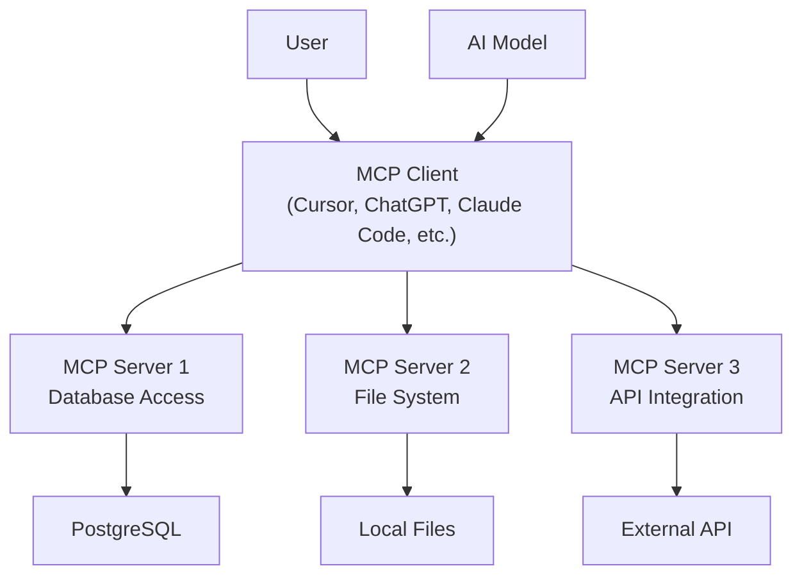

# Model Context Protocol (MCP)

MCP is an open standard that enables AI models to flexibly connect with external data sources and tools. Spearheaded by Anthropic, MCP provides a unified way to integrate AI models with various services, databases, and APIs through a standardized interface of servers and clients.

MCP servers act as bridges between AI models and external systems, providing:

- **Tools**: Functions that AI models can call to perform actions
- **Resources**: Data sources that AI models can read from
- **Prompts**: Reusable prompt templates for common tasks

## Why MCP Matters

### Standardization
Before MCP, every AI application and framework had to implement custom integrations with external services. MCP provides a standard protocol that works across different AI platforms and tools, allowing developers to focus on building more capable agents quickly.

### Security
MCP servers can implement authentication, authorization, and data filtering to ensure AI models only access appropriate data and functions.

### Composability
Multiple MCP servers can be combined to provide comprehensive capabilities, allowing developers to build modular AI systems effortlessly.

### Ecosystem Growth
As more services implement MCP servers, the ecosystem of available AI integrations will make it exponentially easier to construct AI agents with MCP as opposed to without.

## MCP Architecture



### MCP Servers
MCP servers implement the protocol and provide specific capabilities:
- **Database servers**: Query databases, execute SQL
- **File system servers**: Read/write files, search directories
- **API servers**: Integrate with REST APIs, web services
- **Tool servers**: Provide specialized functions and utilities

### MCP Clients
MCP clients (like Claude Desktop and custom AI applications) connect to servers to access their capabilities.

## Key MCP Concepts

### Tools
Tools are functions that MCP servers expose for AI models to call:

```typescript
// Example tool definition
server.tool("search_files", {
  description: "Search for files matching a pattern",
  inputSchema: {
    type: "object",
    properties: {
      pattern: { type: "string" },
      directory: { type: "string" }
    }
  }
}, async (args) => {
  // Tool implementation
  return { results: [...] }
})
```

### Resources
Resources are data sources that AI models can read:

```typescript
// Example resource
server.resource("file://project/readme.md", {
  description: "Project README file",
  mimeType: "text/markdown"
}, async () => {
  return { contents: [...] }
})
```

### Prompts
Reusable prompt templates with parameters:

```typescript
// Example prompt
server.prompt("code_review", {
  description: "Review code for best practices",
  arguments: [
    { name: "language", description: "Programming language" },
    { name: "code", description: "Code to review" }
  ]
}, async (args) => {
  return {
    messages: [
      {
        role: "user",
        content: `Review this ${args.language} code: ${args.code}`
      }
    ]
  }
})
```

## MCP Server Development Challenges

Building reliable MCP servers involves several challenges that the Shinzo Platform addresses:

### Performance Monitoring
- How long do tool calls take?
- Which tools are called most frequently?
- How can servers reduce context consumption?

### Error Tracking
- Which tools are failing and why?
- How often do errors occur?
- What causes resource access failures?

### Usage Analytics
- Which clients use which tools?
- What are common usage patterns?
- How can servers be optimized for real usage?

### Debugging Complex Flows
- How do tool calls chain together?
- What's the full request flow through multiple servers?
- Where do performance issues originate?

## How Shinzo Platform Helps

### MCP-Native Observability
Unlike generic observability tools, Shinzo Platform understands MCP concepts:
- **Tool Execution Tracking**: Monitor individual tool calls with parameters and results
- **Cross-Server Tracing**: Follow requests across multiple MCP servers
- **Protocol-Level Metrics**: Monitor MCP-specific performance characteristics

### Automatic Instrumentation
Our TypeScript SDK automatically instruments MCP servers built with the [@modelcontextprotocol/sdk](https://github.com/modelcontextprotocol/typescript-sdk):

```typescript
import { McpServer } from "@modelcontextprotocol/sdk/server/mcp.js"
import { instrumentServer } from "@shinzolabs/instrumentation-mcp"

const server = new McpServer({
  name: "my-mcp-server",
  version: "1.0.0"
})

// One line adds comprehensive telemetry
const telemetry = instrumentServer(server, {
  serverName: "my-mcp-server",
  serverVersion: "1.0.0",
  exporterEndpoint: "https://api.app.shinzo.ai/telemetry/ingest_http",
  exporterAuth: {
    type: "bearer",
    token: "your-token-here"
  }
})
```

### Privacy and Security
MCP servers may handle sensitive data. Shinzo also includes:
- **Built-in PII Sanitization**: Automatically removes sensitive data from telemetry
- **Configurable Data Processing**: Custom processors to filter or transform data
- **Argument Collection Control**: Choose whether to collect tool arguments

### Rich Context
Track MCP-specific attributes:
- Tool names and execution times
- Resource types and access patterns
- Server versions and capabilities
- Client information and usage patterns

## MCP Ecosystem Examples

### Popular MCP Servers
- **Code Contextualization**: Context7, Sourcebot
- **Browser Use**: Playwright, Browserbase, Stagehand
- **Knowledge and Memory**: Graphiti, Cipher
- **Computer Use**: Cua, Desktop Commander
- **General Software Tools**: Blender, Figma, Excel, Postgres

### Use Cases
- **Code assistance**: AI models accessing codebases, documentation, and development tools
- **Data analysis**: AI models querying databases and processing files
- **Content creation**: AI models accessing templates, resources, and publishing tools
- **Business automation**: AI models integrating with CRM, email, and workflow tools

## Getting Started with MCP:

Ready to build and instrument your MCP server? Check out:

<CardGroup cols={2}>
  <Card title="TypeScript SDK" icon="code" href="/sdk/typescript/installation">
    Add analytics to your MCP server in minutes.
  </Card>
</CardGroup>

The combination of OpenTelemetry's standardization with MCP creates powerful analytics opportunities. Shinzo Platform bridges these technologies to provide comprehensive monitoring for the growing MCP ecosystem.