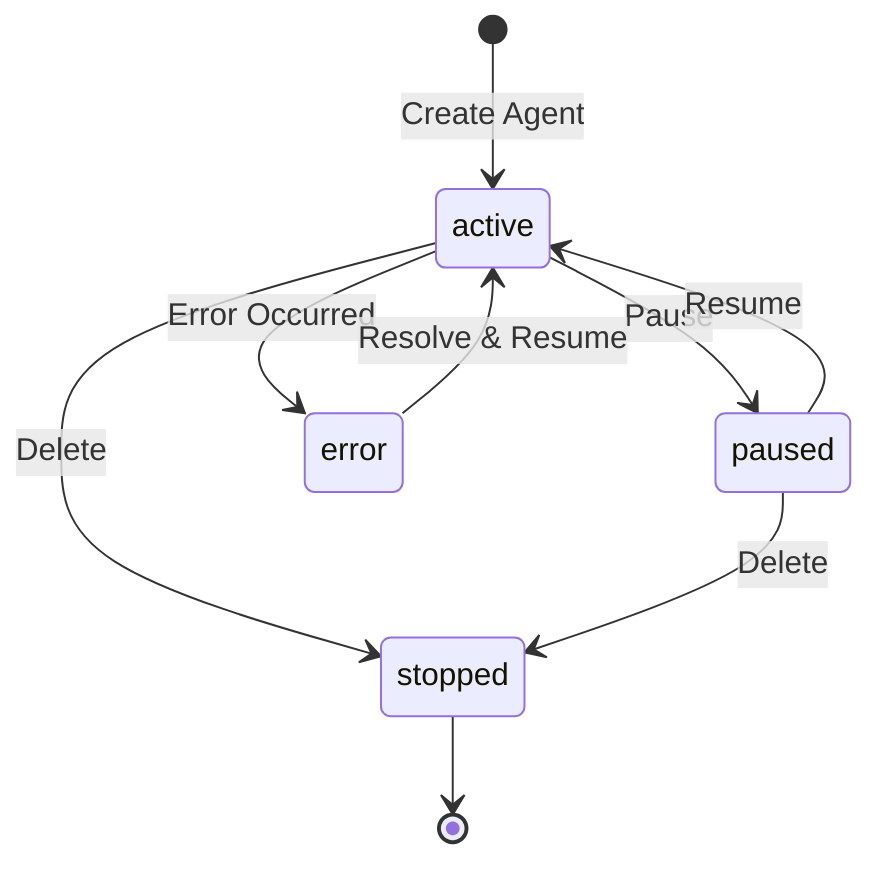

# Agent Management Guide

Master the lifecycle management of AI agents on the Shinzo Platform. This guide covers monitoring, state management, resource optimization, and operational best practices.

## Overview

Agent management encompasses:

- **Lifecycle Control**: Pause, resume, update, and delete agents
- **Task Management**: Queue, monitor, cancel, and retrieve task results
- **Resource Monitoring**: Track CPU, memory, storage, and API usage
- **Filesystem Operations**: Manage workspace files programmatically
- **Troubleshooting**: Diagnose and resolve agent issues
- **Performance Optimization**: Improve efficiency and reduce costs

## Agent States

Understanding agent states is crucial for effective management:

| State | Description | Accepts Tasks | Can Transition To |
|-------|-------------|---------------|-------------------|
| `active` | Running and ready | ✅ Yes | `paused`, `stopped`, `error` |
| `paused` | Temporarily suspended | ❌ No | `active`, `stopped` |
| `stopped` | Permanently stopped | ❌ No | - (terminal state) |
| `error` | Encountered error | ❌ No | `active` (after fix) |

### State Transitions



## Listing Agents

### Get All Agents

```bash
curl -X GET https://api.app.shinzo.ai/agent/list \
  -H "Authorization: Bearer <jwt_token>"
```

**Response:**

```json
{
  "agents": [
    {
      "uuid": "agt_abc123",
      "name": "code-reviewer",
      "status": "active",
      "created_at": "2026-01-15T10:00:00Z",
      "last_task_at": "2026-02-10T14:30:00Z",
      "task_count": 145,
      "pvc_size": "5Gi",
      "storage_used": "2.3Gi"
    },
    {
      "uuid": "agt_def456",
      "name": "data-analyst",
      "status": "paused",
      "created_at": "2026-01-20T09:00:00Z",
      "last_task_at": "2026-02-08T16:00:00Z",
      "task_count": 89,
      "pvc_size": "10Gi",
      "storage_used": "7.1Gi"
    }
  ],
  "total": 2
}
```

### Get Agent Details

```bash
curl -X GET https://api.app.shinzo.ai/agent/agt_abc123 \
  -H "Authorization: Bearer <jwt_token>"
```

**Response:**

```json
{
  "uuid": "agt_abc123",
  "name": "code-reviewer",
  "description": "Automated code review agent",
  "status": "active",
  "created_at": "2026-01-15T10:00:00Z",
  "endpoint_url": "https://agent-abc123.shinzo.ai",
  "container_id": "k8s-pod-xyz789",
  "pvc_size": "5Gi",
  "storage_used": "2.3Gi",
  "storage_available": "2.7Gi",
  "configuration": {
    "timeout_seconds": 3600,
    "memory_config": {
      "type": "hierarchical",
      "max_size_mb": 1024,
      "persistence": "persistent"
    },
    "mcp_servers": {
      "github": {
        "command": "npx",
        "args": ["-y", "@modelcontextprotocol/server-github"]
      }
    }
  },
  "statistics": {
    "total_tasks": 145,
    "completed_tasks": 132,
    "failed_tasks": 8,
    "cancelled_tasks": 5,
    "avg_task_duration_seconds": 180,
    "last_task_at": "2026-02-10T14:30:00Z"
  }
}
```

## Managing Agent State

### Pause Agent

Pause an agent to prevent it from accepting new tasks while preserving its state:

```bash
curl -X POST https://api.app.shinzo.ai/agent/agt_abc123/pause \
  -H "Authorization: Bearer <jwt_token>"
```

**Response:**

```json
{
  "uuid": "agt_abc123",
  "status": "paused",
  "paused_at": "2026-02-17T10:00:00Z"
}
```

**Use Cases:**
- **Maintenance**: Updating configuration or troubleshooting
- **Cost Control**: Temporarily stopping agent activity
- **Rate Limiting**: Managing API quota usage
- **Testing**: Isolating agents during debugging

<Info>
**Active Tasks**: Pausing an agent does not cancel currently running tasks. They will complete normally.
</Info>

### Resume Agent

Resume a paused agent to restore it to active state:

```bash
curl -X POST https://api.app.shinzo.ai/agent/agt_abc123/resume \
  -H "Authorization: Bearer <jwt_token>"
```

**Response:**

```json
{
  "uuid": "agt_abc123",
  "status": "active",
  "resumed_at": "2026-02-17T11:00:00Z"
}
```

### Update Agent Configuration

Modify agent configuration without redeployment:

```bash
curl -X POST https://api.app.shinzo.ai/agent/update/agt_abc123 \
  -H "Authorization: Bearer <jwt_token>" \
  -H "Content-Type: application/json" \
  -d '{
    "description": "Updated description",
    "configuration": {
      "timeout_seconds": 7200,
      "webhooks": {
        "task_complete": "https://myapp.com/webhooks/new-endpoint"
      }
    }
  }'
```

**Updatable Fields:**
- `description` - Agent description
- `configuration.timeout_seconds` - Task timeout
- `configuration.webhooks` - Webhook URLs
- `configuration.memory_config` - Memory settings

**Non-Updatable Fields:**
- `name` - Agent name (set at creation)
- `anthropic_api_key` - API key (security restriction)
- `pvc_size` - Storage size (requires recreation)
- `mcp_servers` - MCP configuration (requires restart)

<Warning>
**Configuration Changes**: Some updates (like memory config) may require an agent restart to take effect.
</Warning>

### Delete Agent

Permanently delete an agent and all its data:

```bash
curl -X POST https://api.app.shinzo.ai/agent/delete/agt_abc123 \
  -H "Authorization: Bearer <jwt_token>"
```

**Response:**

```json
{
  "uuid": "agt_abc123",
  "status": "stopped",
  "deleted_at": "2026-02-17T12:00:00Z",
  "message": "Agent and all associated data have been deleted"
}
```

<Warning>
**Data Loss**: Deleting an agent permanently removes all files, memory, and task history. This action cannot be undone. Consider exporting important data before deletion.
</Warning>

## Task Management

### Submit Task

Submit a task with priority and metadata:

```bash
curl -X POST https://api.app.shinzo.ai/agent/request/agt_abc123 \
  -H "Authorization: Bearer <jwt_token>" \
  -H "Content-Type: application/json" \
  -d '{
    "message": "Review the pull request in /workspace/pr-diff.txt",
    "priority": 8,
    "timeout_override": 1800,
    "metadata": {
      "pr_number": 42,
      "repository": "myorg/myrepo"
    }
  }'
```

**Response:**

```json
{
  "task_id": "tsk_xyz789",
  "status": "queued",
  "created_at": "2026-02-17T10:00:00Z",
  "estimated_start": "2026-02-17T10:00:05Z",
  "poll_url": "https://api.app.shinzo.ai/agent/agt_abc123/task/tsk_xyz789",
  "cancel_url": "https://api.app.shinzo.ai/agent/agt_abc123/task/tsk_xyz789/cancel"
}
```

### Monitor Task Status

Poll task status and progress:

```bash
curl -X GET https://api.app.shinzo.ai/agent/agt_abc123/task/tsk_xyz789 \
  -H "Authorization: Bearer <jwt_token>"
```

**Response (Running):**

```json
{
  "task_id": "tsk_xyz789",
  "status": "running",
  "created_at": "2026-02-17T10:00:00Z",
  "started_at": "2026-02-17T10:00:05Z",
  "progress": {
    "current_step": "Analyzing code changes",
    "steps_completed": 3,
    "total_steps": 7
  }
}
```

**Response (Completed):**

```json
{
  "task_id": "tsk_xyz789",
  "status": "completed",
  "created_at": "2026-02-17T10:00:00Z",
  "started_at": "2026-02-17T10:00:05Z",
  "completed_at": "2026-02-17T10:03:45Z",
  "result": {
    "summary": "Code review completed",
    "findings": [
      {
        "file": "src/auth.js",
        "line": 42,
        "severity": "warning",
        "message": "Consider using environment variables for secrets"
      }
    ],
    "recommendations": [
      "Add input validation to user registration",
      "Implement rate limiting on login endpoint"
    ]
  }
}
```

### Task States

| State | Description | Next Actions |
|-------|-------------|--------------|
| `queued` | Waiting to start | Poll status, cancel |
| `running` | Currently executing | Poll status, send message, cancel |
| `awaiting_input` | Needs user input | Send message, cancel |
| `completed` | Finished successfully | Retrieve results |
| `failed` | Encountered error | Review error, retry |
| `cancelled` | User cancelled | Review partial results |

### Send Message to Task

Provide input to a running task (especially when `awaiting_input`):

```bash
curl -X POST https://api.app.shinzo.ai/agent/agt_abc123/task/tsk_xyz789/message \
  -H "Authorization: Bearer <jwt_token>" \
  -H "Content-Type: application/json" \
  -d '{
    "message": "Yes, proceed with the refactoring"
  }'
```

### Cancel Task

Cancel a running or queued task:

```bash
curl -X POST https://api.app.shinzo.ai/agent/agt_abc123/task/tsk_xyz789/cancel \
  -H "Authorization: Bearer <jwt_token>"
```

**Response:**

```json
{
  "task_id": "tsk_xyz789",
  "status": "cancelled",
  "cancelled_at": "2026-02-17T10:02:00Z",
  "partial_result": {
    "summary": "Task cancelled by user",
    "progress": "50% complete when cancelled"
  }
}
```

## Filesystem Management

### List Files

Browse agent workspace files:

```bash
curl -X GET https://api.app.shinzo.ai/agent/agt_abc123/filesystem/directories/workspace \
  -H "Authorization: Bearer <jwt_token>"
```

**Response:**

```json
{
  "path": "/workspace",
  "entries": [
    {
      "name": "config",
      "type": "directory",
      "modified_at": "2026-02-15T10:00:00Z"
    },
    {
      "name": "data.json",
      "type": "file",
      "size": 2048,
      "modified_at": "2026-02-17T09:30:00Z"
    }
  ]
}
```

### Read File

Retrieve file contents:

```bash
curl -X GET https://api.app.shinzo.ai/agent/agt_abc123/filesystem/files/workspace/data.json \
  -H "Authorization: Bearer <jwt_token>"
```

### Create/Update Files

Write files to agent workspace:

```bash
# Create new file
curl -X POST https://api.app.shinzo.ai/agent/agt_abc123/filesystem/files/workspace/config.json \
  -H "Authorization: Bearer <jwt_token>" \
  -H "Content-Type: application/json" \
  -d '{
    "content": "{\"setting\": \"value\"}"
  }'

# Update existing file
curl -X PUT https://api.app.shinzo.ai/agent/agt_abc123/filesystem/files/workspace/config.json \
  -H "Authorization: Bearer <jwt_token>" \
  -H "Content-Type: application/json" \
  -d '{
    "content": "{\"setting\": \"new_value\"}"
  }'
```

### Delete Files

Remove files from workspace:

```bash
curl -X DELETE https://api.app.shinzo.ai/agent/agt_abc123/filesystem/files/workspace/old-data.json \
  -H "Authorization: Bearer <jwt_token>"
```

## Resource Monitoring

### Storage Usage

Monitor agent storage consumption:

```bash
curl -X GET https://api.app.shinzo.ai/agent/agt_abc123 \
  -H "Authorization: Bearer <jwt_token>" | jq '.storage_used, .storage_available, .pvc_size'
```

**Warning Thresholds:**
- 🟢 **< 70% used**: Normal operation
- 🟡 **70-90% used**: Consider cleanup or expansion
- 🔴 **> 90% used**: Urgent action required

**Storage Management:**
1. Review and delete unused files
2. Archive old task results
3. Increase PVC size (requires agent recreation)

### Task Statistics

Track agent task performance:

```bash
curl -X GET https://api.app.shinzo.ai/agent/agt_abc123 \
  -H "Authorization: Bearer <jwt_token>" | jq '.statistics'
```

**Key Metrics:**
- `total_tasks` - Total tasks submitted
- `completed_tasks` - Successfully completed tasks
- `failed_tasks` - Failed tasks (investigate if high)
- `avg_task_duration_seconds` - Average execution time
- `last_task_at` - Most recent task timestamp

### Performance Optimization

**If tasks are slow:**
1. Check agent resource usage in dashboard
2. Review task complexity and optimize instructions
3. Consider breaking large tasks into smaller ones
4. Verify MCP servers are responsive
5. Check Anthropic API rate limits

**If failure rate is high:**
1. Review error logs in dashboard
2. Verify MCP server credentials are valid
3. Check timeout settings are appropriate
4. Ensure sufficient storage space
5. Validate task instructions are clear

## Webhook Management

### Testing Webhooks

Verify webhook endpoints are reachable:

```bash
# Test webhook locally
curl -X POST https://myapp.com/webhooks/task-complete \
  -H "Content-Type: application/json" \
  -H "X-Shinzo-Signature: test-signature" \
  -d '{
    "event": "task_complete",
    "agent_id": "agt_abc123",
    "task_id": "tsk_xyz789",
    "timestamp": "2026-02-17T10:00:00Z"
  }'
```

### Webhook Signature Verification

Verify webhook authenticity (Python example):

```python
import hmac
import hashlib

def verify_webhook_signature(payload: str, signature: str, secret: str) -> bool:
    """Verify Shinzo webhook signature."""
    expected = hmac.new(
        secret.encode(),
        payload.encode(),
        hashlib.sha256
    ).hexdigest()
    return hmac.compare_digest(signature, expected)

# Usage
is_valid = verify_webhook_signature(
    payload=request.body.decode(),
    signature=request.headers['X-Shinzo-Signature'],
    secret=WEBHOOK_SECRET
)
```

### Updating Webhooks

Update webhook URLs without downtime:

```bash
curl -X POST https://api.app.shinzo.ai/agent/update/agt_abc123 \
  -H "Authorization: Bearer <jwt_token>" \
  -H "Content-Type: application/json" \
  -d '{
    "configuration": {
      "webhooks": {
        "task_complete": "https://myapp.com/webhooks/v2/task-complete",
        "task_failed": "https://myapp.com/webhooks/v2/task-failed"
      }
    }
  }'
```

## Best Practices

### 1. Regular Health Checks

Implement automated health monitoring:

```python
import requests

def check_agent_health(agent_id: str, token: str) -> dict:
    """Check agent health status."""
    response = requests.get(
        f"https://api.app.shinzo.ai/agent/{agent_id}",
        headers={"Authorization": f"Bearer {token}"}
    )

    agent = response.json()

    return {
        "status": agent["status"],
        "storage_usage_pct": (
            float(agent["storage_used"].rstrip("Gi")) /
            float(agent["pvc_size"].rstrip("Gi"))
        ) * 100,
        "failure_rate": (
            agent["statistics"]["failed_tasks"] /
            agent["statistics"]["total_tasks"]
        ) * 100 if agent["statistics"]["total_tasks"] > 0 else 0
    }
```

### 2. Graceful Task Management

Always implement proper error handling:

```python
async def submit_task_with_retry(agent_id: str, message: str, max_retries: int = 3):
    """Submit task with automatic retry logic."""
    for attempt in range(max_retries):
        try:
            response = requests.post(
                f"https://api.app.shinzo.ai/agent/request/{agent_id}",
                headers={"Authorization": f"Bearer {token}"},
                json={"message": message, "priority": 5}
            )
            response.raise_for_status()
            return response.json()
        except requests.exceptions.HTTPError as e:
            if e.response.status_code == 503:  # Agent unavailable
                await asyncio.sleep(2 ** attempt)  # Exponential backoff
            else:
                raise
    raise Exception("Max retries exceeded")
```

### 3. Resource Cleanup

Periodically clean up old files and data:

```bash
# List old files
curl -X GET https://api.app.shinzo.ai/agent/agt_abc123/filesystem/directories/workspace/logs \
  -H "Authorization: Bearer <jwt_token>"

# Delete files older than 30 days
# (implement date filtering in your application logic)
```

### 4. Configuration Versioning

Track agent configurations in version control:

```yaml
# agents.yaml
agents:
  - name: code-reviewer
    anthropic_api_key: ${ANTHROPIC_API_KEY}
    pvc_size: 5Gi
    configuration:
      timeout_seconds: 3600
      mcp_servers:
        github:
          command: npx
          args: ["-y", "@modelcontextprotocol/server-github"]
          env:
            GITHUB_TOKEN: ${GITHUB_TOKEN}
```

### 5. Observability Integration

Enable comprehensive monitoring:

```javascript
// Configure agent with observability
const agentConfig = {
  name: "production-agent",
  anthropic_api_key: process.env.ANTHROPIC_API_KEY,
  configuration: {
    webhooks: {
      task_complete: `${WEBHOOK_BASE_URL}/task-complete`,
      task_failed: `${WEBHOOK_BASE_URL}/task-failed`,
      agent_error: `${WEBHOOK_BASE_URL}/agent-error`
    }
  }
};

// Implement webhook handlers
app.post('/webhooks/task-complete', (req, res) => {
  const { task_id, agent_id, data } = req.body;

  // Log to monitoring system
  logger.info('Task completed', { task_id, agent_id, duration: data.duration });

  // Update metrics
  metrics.increment('agent.tasks.completed');
  metrics.histogram('agent.task.duration', data.duration);

  res.status(200).send('OK');
});
```

## Troubleshooting

### Agent Stuck in Error State

**Symptoms:**
- Agent status is `error`
- New tasks are rejected

**Solutions:**
1. Check agent logs in dashboard
2. Verify Anthropic API key is valid
3. Check MCP server connectivity
4. Resume agent: `POST /agent/:id/resume`
5. If issue persists, recreate agent

### High Task Failure Rate

**Symptoms:**
- Many tasks fail with errors
- Inconsistent results

**Solutions:**
1. Review failed task error messages
2. Check task instructions clarity
3. Verify sufficient timeout settings
4. Validate MCP server credentials
5. Ensure adequate storage space

### Webhook Not Receiving Events

**Symptoms:**
- Expected webhooks not arriving
- Task completion not triggering notifications

**Solutions:**
1. Verify webhook URL is publicly accessible
2. Check webhook endpoint returns 2xx status
3. Review webhook signature verification logic
4. Test webhook with `curl` directly
5. Check agent configuration has correct webhook URLs

### Storage Full

**Symptoms:**
- Tasks fail with storage errors
- Agent status shows 100% storage usage

**Solutions:**
1. Delete unnecessary files via Filesystem API
2. Archive old task results externally
3. Recreate agent with larger PVC size
4. Implement automated cleanup policies

## Next Steps

<CardGroup cols={2}>
  <Card title="Agent Deployment" icon="rocket" href="/platform/agent-deployment">
    Learn how to deploy new agents
  </Card>
  <Card title="Task Management API" icon="list-check" href="/api/agents/tasks">
    Detailed task management API reference
  </Card>
  <Card title="Filesystem API" icon="folder" href="/api/agents/filesystem">
    Complete filesystem operations guide
  </Card>
  <Card title="Agent Analytics" icon="chart-line" href="/platform/agent-analytics">
    Monitor agent performance and usage
  </Card>
</CardGroup>

## Support

Need help with agent management?

- 📧 Email: [support@shinzolabs.com](mailto:support@shinzolabs.com)
- 📚 Documentation: [docs.shinzo.ai](https://docs.shinzo.ai)
- 💬 Community: [Discord](https://discord.gg/shinzo)
