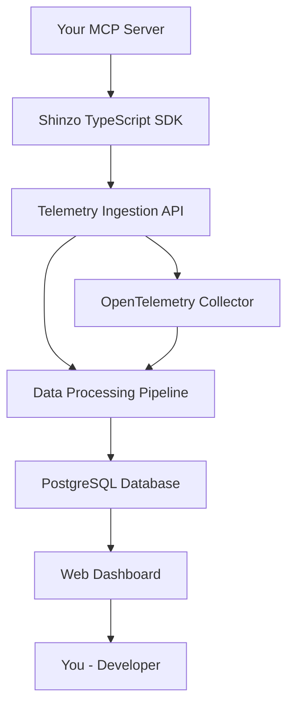

# Platform Overview

Shinzo Platform is a comprehensive observability solution designed specifically for Model Context Protocol (MCP) developers. Our web-based dashboard provides real-time insights into your MCP servers' performance, usage patterns, and health metrics.

## Key Features

### Real-time Dashboard
Monitor your MCP servers with live telemetry data including:
- Request rates and response times
- Error rates and success metrics
- Resource utilization patterns
- Server health and availability

### Trace Analysis
Deep dive into individual requests with distributed tracing:
- Complete request flows across MCP tools
- Tool execution timing and dependencies
- Error identification and debugging
- Performance bottleneck analysis

### Resource Monitoring
Track your MCP server resources and their usage:
- Tool invocation patterns
- Resource access frequencies
- Performance characteristics
- Availability metrics

### Ingest Token Management
Secure telemetry ingestion with managed authentication:
- Generate and manage ingest tokens
- Control access to telemetry data
- Rotate tokens for security
- Monitor token usage

## Architecture

Shinzo Platform consists of several integrated components:

### Components

- **Telemetry Ingestion API**: Receives OpenTelemetry data via HTTP/gRPC
- **Data Processing Pipeline**: Processes and stores telemetry data
- **PostgreSQL Database**: Stores traces, metrics, and resource data
- **Web Dashboard**: React-based frontend for data visualization
- **TypeScript SDK**: Automatic instrumentation for MCP servers

## Getting Started

1. **Sign up** for a Shinzo Platform account at [app.shinzo.ai](https://app.shinzo.ai)
2. **Generate** an ingest token in Settings
3. **Install** the TypeScript SDK: `npm install @shinzolabs/instrumentation-mcp`
4. **Instrument** your MCP server with one line of code
5. **View** telemetry data in the dashboard

## Data Types

### Traces
Complete request flows through your MCP server:
- Tool executions
- Resource accesses
- Internal operations
- External API calls

### Spans
Individual operations within traces:
- Tool invocations
- Database queries
- File operations
- Network requests

### Metrics
Quantitative measurements:
- Request rates
- Response times
- Error counts
- Resource utilization

### Resources
Metadata about your MCP servers:
- Server information
- Version details
- Configuration data
- Environment attributes

## Privacy and Security

### Data Protection
- **PII Sanitization**: Automatic detection and removal of sensitive data
- **Configurable Processing**: Custom data processors for your specific needs
- **Argument Collection Control**: Choose what data to collect
- **Secure Transport**: All data encrypted in transit

### Access Control
- **Token-based Authentication**: Secure ingest tokens for data submission
- **User Isolation**: Each user's data is completely isolated
- **Session Management**: Secure web sessions with JWT tokens

## Supported Platforms

### MCP SDK Compatibility
- `@modelcontextprotocol/sdk` v1.15.1+
- Node.js 18+
- TypeScript 4.5+

### Export Formats
- OpenTelemetry Protocol (OTLP) HTTP
- OpenTelemetry Protocol (OTLP) gRPC
- Console output (development)

### Integration Options
- Direct instrumentation with TypeScript SDK
- OpenTelemetry Collector integration
- Custom telemetry pipelines
- Third-party observability tools

## Use Cases

### Development
- Debug MCP server issues
- Optimize tool performance
- Monitor development environments
- Test new features

### Production
- Monitor server health
- Track usage patterns
- Identify performance issues
- Plan capacity scaling

### Analytics
- Understand user behavior
- Optimize tool usage
- Measure feature adoption
- Generate usage reports

## Next Steps

Ready to get started? Choose your next step:

<CardGroup cols={2}>
  <Card title="Quick Start" icon="rocket" href="/quickstart">
    Get your MCP server instrumented in 5 minutes
  </Card>
  <Card title="Dashboard Guide" icon="chart-line" href="/platform/dashboard">
    Learn how to use the web dashboard
  </Card>
  <Card title="TypeScript SDK" icon="code" href="/sdk/typescript/installation">
    Complete SDK documentation and examples
  </Card>
  <Card title="API Reference" icon="book" href="/api-reference/telemetry/overview">
    Technical API documentation
  </Card>
</CardGroup>

## Support

Need help? We're here to assist:
- **Email**: [austin@shinzolabs.com](mailto:austin@shinzolabs.com)
- **GitHub**: [github.com/shinzo-labs](https://github.com/shinzo-labs)
- **Documentation**: Complete guides and examples throughout this site