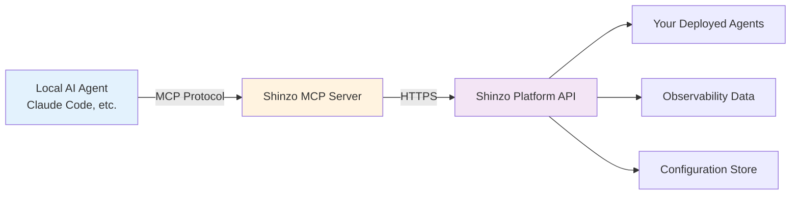

## Overview

The Shinzo MCP (Model Context Protocol) Server is a powerful integration that gives your local AI agents—such as Claude Code, Claude Desktop, or custom agent implementations—direct access to all Shinzo platform functionality. Think of it as an "infrastructure as code" interface for AI agents.

<Card title="What is MCP?" icon="lightbulb" href="/concepts/mcp">
  Learn about the Model Context Protocol and how it enables AI agents to access external tools and data
</Card>

## Key Benefits

<CardGroup cols={2}>
  <Card title="Unified Platform Access" icon="plug">
    Access agents, observability, tasks, and configuration management from any MCP-compatible AI tool
  </Card>

  <Card title="Natural Language Control" icon="message">
    Deploy agents, check metrics, and manage infrastructure using conversational commands
  </Card>

  <Card title="Workflow Automation" icon="robot">
    Build automated workflows that combine AI reasoning with platform operations
  </Card>

  <Card title="Developer-Friendly" icon="code">
    Infrastructure as code approach—version control your agent configurations and deployments
  </Card>
</CardGroup>

## What Can You Do?

With the Shinzo MCP Server, your AI agents can:

### Agent Management
- **Deploy new agents** with custom configurations
- **List and monitor** all your deployed agents
- **Update agent settings** including MCP servers, initial files, and quotas
- **Pause, resume, and delete** agents as needed
- **Check agent status** and health

### Task Execution
- **Create and submit tasks** to your agents
- **Monitor task progress** and status
- **Retrieve task results** when complete
- **Cancel running tasks** if needed

### Observability & Analytics
- **Query telemetry data** for tokens, costs, and performance
- **View traces and spans** to debug agent behavior
- **Analyze performance metrics** across time periods
- **Track resource usage** and quota consumption

### MCP Server Configuration
- **Add MCP servers** to your agents (GitHub, filesystem, PostgreSQL, custom, etc.)
- **List configured servers** for any agent
- **Remove servers** when no longer needed
- **Update server configurations** dynamically

### Platform Management
- **Manage API keys** for platform access
- **Configure webhooks** for real-time notifications
- **Check quota limits** and usage

## How It Works



The Shinzo MCP Server acts as a bridge between your local AI agent and the Shinzo platform:

1. **Your AI agent** (e.g., Claude Code) uses natural language to describe what it wants to do
2. **The MCP protocol** translates this into structured tool calls
3. **Shinzo MCP Server** receives these tool calls and authenticates them
4. **Platform API** executes the requested operations
5. **Results** flow back through the chain to your AI agent

## Authentication & Security

The Shinzo MCP Server uses **Bearer token authentication** with your Platform API key:

<Steps>
  <Step title="Generate API Key">
    Create a Platform API key from your [Shinzo dashboard](https://app.shinzo.ai/settings/api-keys)
  </Step>

  <Step title="Configure Access">
    Add the key to your MCP server configuration (environment variable or HTTP header)
  </Step>

  <Step title="Secure Storage">
    Store credentials in environment variables or secure secret management systems
  </Step>
</Steps>

<Warning>
**Never commit API keys to version control.** Use environment variables or secure secret management services.
</Warning>

### Security Best Practices

- **Use dedicated API keys** for MCP server access (separate from other integrations)
- **Rotate keys regularly** (recommended: every 90 days)
- **Monitor usage** through the observability dashboard
- **Revoke compromised keys immediately** from the dashboard
- **Use scoped permissions** if your plan supports granular access control

## Available Connection Methods

The Shinzo MCP Server supports two connection modes:

### 1. HTTP/SSE Mode (Recommended)

Connect directly to the hosted Shinzo MCP server via HTTPS:

```json
{
  "mcpServers": {
    "shinzo": {
      "url": "https://api.app.shinzo.ai/v1/mcp",
      "headers": {
        "Authorization": "Bearer YOUR_API_KEY"
      }
    }
  }
}
```

**Pros:**
- ✅ No local installation required
- ✅ Always up-to-date with latest features
- ✅ Managed by Shinzo (no maintenance burden)
- ✅ Built-in rate limiting and error handling

**Cons:**
- ❌ Requires internet connection
- ❌ Subject to API rate limits

### 2. stdio Mode (npm Package)

Run the MCP server locally as a Node.js process:

```json
{
  "mcpServers": {
    "shinzo": {
      "command": "npx",
      "args": ["-y", "@shinzo-labs/mcp-server"],
      "env": {
        "SHINZO_API_KEY": "YOUR_API_KEY"
      }
    }
  }
}
```

**Pros:**
- ✅ Works offline (after initial setup)
- ✅ Lower latency for tool calls
- ✅ No rate limits (limited only by platform API)

**Cons:**
- ❌ Requires Node.js installation
- ❌ Must update package manually for new features
- ❌ Slightly more complex setup

<Info>
**Which mode should I use?** We recommend **HTTP/SSE mode** for most users. It's simpler to set up and always stays current. Use stdio mode if you need offline functionality or have specific latency requirements.
</Info>

## Getting Started

Ready to connect your AI agent to Shinzo? Follow our installation guide:

<Card title="Install Shinzo MCP Server" icon="download" href="/platform/install-shinzo-mcp">
  Step-by-step installation for Claude Code, Claude Desktop, and custom configurations
</Card>

## Next Steps

<CardGroup cols={2}>
  <Card title="Installation Guide" icon="download" href="/platform/install-shinzo-mcp">
    Set up the Shinzo MCP server in your AI agent
  </Card>

  <Card title="Available Tools" icon="toolbox" href="/platform/shinzo-mcp-tools">
    Explore all tools provided by the MCP server
  </Card>

  <Card title="Examples & Use Cases" icon="book" href="/platform/shinzo-mcp-examples">
    See real-world workflows and example commands
  </Card>

  <Card title="Troubleshooting" icon="wrench" href="/platform/shinzo-mcp-troubleshooting">
    Debug common issues and connection problems
  </Card>
</CardGroup>

## Learn More

<CardGroup cols={2}>
  <Card title="Agent Deployment" icon="rocket" href="/platform/agent-deployment">
    Learn how to deploy agents programmatically
  </Card>

  <Card title="Platform API Reference" icon="code" href="/api/overview">
    Explore the underlying API that powers the MCP server
  </Card>

  <Card title="MCP Protocol Spec" icon="book-open" href="https://spec.modelcontextprotocol.io">
    Dive deep into the Model Context Protocol specification
  </Card>

  <Card title="Claude Code Integration" icon="terminal" href="/ai-tools/claude-code">
    Learn about using Claude Code with Shinzo
  </Card>
</CardGroup>
